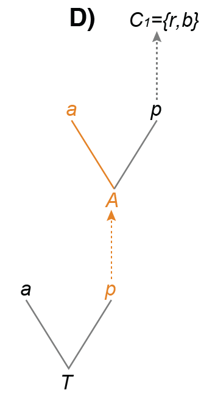

Build an embedded-dependency (ED) matrix in R, paste it into RevBayes, and infer a tree using the original [MorphoModels](https://github.com/sergeitarasov/MorphoModels) datasets. No data simulation is needed.

## 1. Install the R packages

Use a recent R version. Install the GitHub dependencies **before** `rphenoscate`:

```{r eval=FALSE} 
# install.packages("remotes")
remotes::install_github("uyedaj/treeplyr", upgrade = "never")
remotes::install_github("phenoscape/rphenoscape", upgrade = "never")
remotes::install_github("uyedaj/rphenoscate", upgrade = "never")
library(rphenoscape)
```

`rphenoscate` constructs the matrices; `rphenoscape` and `treeplyr` are dependencies. These commands were tested on this Mac in a separate R library. If compilation tools are requested for `treeplyr`, install Xcode Command Line Tools on macOS or Rtools on Windows.

Install [RevBayes](https://revbayes.github.io/download) separately. Run all commands below from the folder containing this tutorial.

## 2. Tail armor

The hierarchy is **tail presence, armor presence, armor color**. First combine armor with its color, then add the tail.

{width=180px}

### Construct the matrix in R

```{r}
#| eval: true
library(rphenoscate)

T <- initQ(c("T*", "T"), 1)
A <- initQ(c("A*", "A"), 1)
C <- initQ(c("r", "b"), 1)

Qarmor <- amaED(A, C, type = "ql")
Qta <- amaED(T, Qarmor, type = "ap")

rownames(Qta)
cat(as_matrixRB(Qta))
```

The state order is **no tail, unarmored tail, red armor, blue armor**. The supplied file uses symbols **0, 1, 2, 3**, corresponding to taxa **A, B, C, D**.

Copy the printed matrix into `rates := [...]` in [tail-armor.Rev](tail-armor.Rev), then run:

```bash
rb tail-armor.Rev
```

This uses the original `tail-armor.nex` (4 taxa, 50 columns) and the paper's ED3 model, with no topology constraints. The example files retain the original repeated column patterns; they are designed model demonstrations, not new independent simulations.

## 3. View the results

The script runs 20,000 tuning generations and 100,000 sampling generations. Results go into `output/`: a parameter log, sampled trees, an MCC tree, and a consensus tree. This example uses the original variable-character correction and fixed relative rates.

Open `output/tail-armor.consensus.tre` in FigTree, or plot it in R:

```{r}
library(ape)
plot(read.nexus("output/tail-armor.consensus.tre"))
```

In the previously checked 20,000-generation run, the model grouped C and D (the armored taxa), with posterior support about 0.92. It placed B next, with A outside that group.

These are short teaching runs. Check the logs and repeat with a different `seed()` before interpreting posterior support. Increase `generations` if needed.


## Sources

Tarasov (2023), [New Phylogenetic Markov Models for Inapplicable Morphological Characters](https://doi.org/10.1093/sysbio/syad005). Dependency diagram from the author's [matrix-construction vignette](https://github.com/sergeitarasov/MorphoModels/wiki/Constructing-rate-matrices-for-ED-models).

The NEXUS file is an unchanged copy of `TA-50char.nex` from `1_ED_model_performance/RB_run_1/data/`. The RevBayes script uses the original ED3 model, priors and root treatment, with a shorter MCMC run and no marginal-likelihood calculations. The topology is inferred freely.


